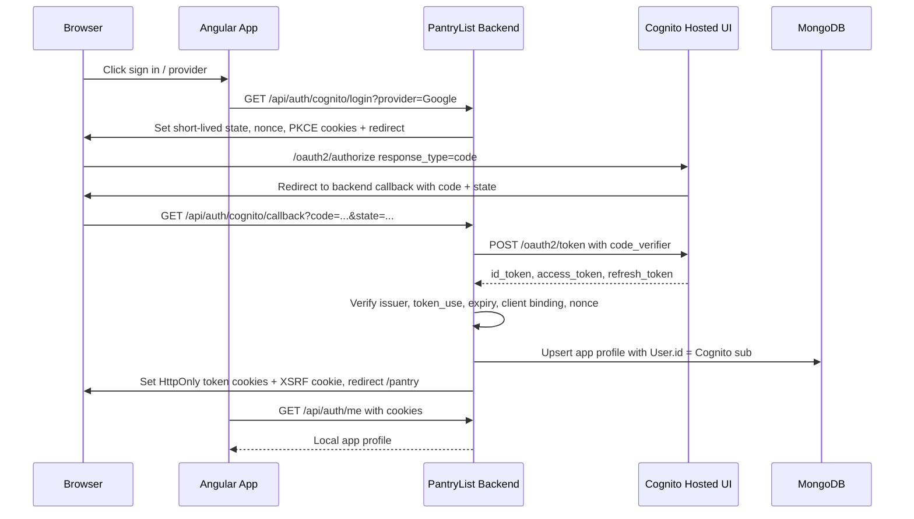

# Cognito Auth Replacement Design

## Status
- Direction approved in chat on 2026-04-27 Central Time.
- Written-spec review pending before runtime implementation.
- Runtime code has not been changed by this design step.

## Goal
Replace PantryList's local email/password authentication with Amazon Cognito as
the single authentication authority while preserving PantryList's local app data
ownership model.

This means PantryList no longer registers passwords, verifies passwords, stores
password credentials, issues local JWTs, rotates local refresh sessions, or owns
password-reset flows. Cognito owns authentication, social identity providers,
password recovery, and token issuance.

## Non-goals
- Do not deploy to production yet.
- Do not create AWS CDK infrastructure in this slice.
- Do not keep a parallel local-password fallback.
- Do not migrate old local development accounts automatically. Because this app
  is not in production, existing local accounts are disposable unless a later
  migration/import task explicitly preserves them.
- Do not store Cognito tokens in browser localStorage or sessionStorage.

## Current State From The Repo
- `backend/src/infrastructure/http/controllers/auth.controller.ts` exposes local
  `/auth/register`, `/auth/login`, `/auth/refresh`, `/auth/logout`,
  `/auth/password/forgot`, `/auth/password/reset`, and
  `/auth/claim-imported-account` endpoints.
- `backend/src/application/services/auth-session.service.ts` signs local access
  and refresh JWTs and persists refresh sessions.
- `backend/src/infrastructure/http/auth/access-token.guard.ts` verifies local
  JWT claims through `JWT_SESSION_SERVICE`, loads `User` from `USER_DAO`, and
  enforces XSRF for mutating requests.
- `backend/src/infrastructure/http/auth/auth-cookie.service.ts` already centralizes
  HttpOnly access/refresh cookies and the readable `XSRF-TOKEN` cookie.
- `backend/src/application/tokens.ts` still defines local auth dependencies:
  `PASSWORD_CREDENTIAL_DAO`, `REFRESH_SESSION_DAO`,
  `PASSWORD_RESET_TOKEN_DAO`, `PASSWORD_HASHER`, `TOKEN_HASHER`, and
  `JWT_SESSION_SERVICE`.
- `backend/src/domain/entities/user.entity.ts` stores the local app profile:
  `id`, `email`, `username`, `status`, `createdAt`, and `updatedAt`.
- `backend/src/domain/value-objects/user-id.vo.ts` accepts any non-empty string,
  so Cognito `sub` can become the PantryList user id without changing the value
  object.
- `frontend/src/app/core/services/auth-api.service.ts` calls the current local
  auth API for login, registration, password reset, account claim, refresh, and
  logout.
- `frontend/src/app/store/auth/auth.effects.ts` schedules local refresh calls
  every ten minutes and navigates after local login/register/claim actions.
- `frontend/src/app/app-routing.module.ts` still routes to local register,
  forgot-password, reset-password, and legacy account claim screens.

## Target Architecture
Cognito becomes the auth authority. PantryList keeps a local `users` collection
only as an application profile and ownership boundary.

## Components
### Cognito Hosted UI
- Use Cognito managed login/Hosted UI for first-party Cognito users and social
  providers such as Google and Facebook.
- The Angular login page becomes a launcher for backend redirect endpoints
  instead of a password form.
- Provider-specific buttons may pass `identity_provider=Google`,
  `identity_provider=Facebook`, or another configured provider through the
  backend login endpoint.

### Backend Cognito Auth Module
Add a backend Cognito auth slice with these responsibilities:
- Build Cognito authorization URLs.
- Generate cryptographically random `state`, `nonce`, and PKCE `code_verifier`.
- Store transient auth transaction values in short-lived, HttpOnly cookies.
- Exchange authorization codes at Cognito's token endpoint.
- Verify Cognito JWTs with JWKS caching.
- Upsert a PantryList app profile from verified Cognito claims.
- Set and clear PantryList cookies.
- Expose a minimal `/auth/me`, `/auth/refresh`, and `/auth/logout` API for the
  Angular app.

### Local App Profile
The local `users` collection remains active, but it no longer represents an
auth credential. It becomes app profile and ownership data.

Rules:
- `User.id` equals the verified Cognito `sub`.
- `email` comes from verified token claims and is required. If Cognito does not
  provide an email, the callback fails with a safe authentication error.
- `username` is derived from `preferred_username`, `name`, or the email local
  part. If it collides, append a stable suffix from the Cognito `sub`.
- `status` remains a PantryList app-level gate. Disabled local profiles cannot
  access pantry APIs even if Cognito authentication succeeds.

### Access Token Guard
Replace local JWT verification in `AccessTokenGuard` with Cognito token
verification.

The guard should:
- Read the Cognito access token from the existing access cookie.
- Verify signature through Cognito JWKS.
- Validate issuer, expiry, `token_use=access`, and the app-client binding.
- Resolve the local user profile by Cognito `sub`.
- Keep XSRF enforcement for non-GET/HEAD/OPTIONS requests.
- Set `request.authUser = { userId: cognitoSub }`.

### Cookie Strategy
Keep server-managed cookies to avoid token exposure in browser storage.

Cookies:
- `pantrylist_access_token`: HttpOnly Cognito access token, path `/`.
- `pantrylist_refresh_token`: HttpOnly Cognito refresh token, path `/api/auth`.
- `XSRF-TOKEN`: readable anti-CSRF token, path `/`.
- Temporary login transaction cookies: HttpOnly, short TTL, path
  `/api/auth/cognito`.

Production defaults:
- `AUTH_COOKIE_SECURE=true`.
- `AUTH_COOKIE_SAME_SITE=lax` unless cross-site deployment requires `none`.
- `AUTH_COOKIE_DOMAIN` only when the deployment domain needs shared subdomain
  cookies.

Local HTTP defaults:
- `AUTH_COOKIE_SECURE=false` is allowed only for localhost development.

### Frontend Auth Flow
The Angular auth store remains useful, but its commands change shape:
- `bootstrapSession` still calls `/api/auth/me`.
- `login` becomes browser navigation to `/api/auth/cognito/login`.
- Provider buttons navigate to
  `/api/auth/cognito/login?provider=Google` and
  `/api/auth/cognito/login?provider=Facebook` when enabled.
- `register`, `forgotPassword`, and `resetPassword` no longer call PantryList
  local endpoints. Cognito Hosted UI owns those journeys.
- `claimImportedAccount` is removed from the active auth route set unless a
  later import/migration feature explicitly needs it.
- `refreshSession` calls `/api/auth/refresh`, which exchanges the Cognito
  refresh token for new Cognito tokens and resets cookies.
- `logout` calls `/api/auth/logout`, clears PantryList cookies, and then
  navigates to the Cognito logout URL returned by the backend so Hosted UI
  sessions are not left surprising.

## API Shape
Recommended endpoints:

| Method | Endpoint | Purpose |
| --- | --- | --- |
| `GET` | `/api/auth/cognito/login` | Start Hosted UI login with optional `provider` and `redirectTo`. |
| `GET` | `/api/auth/cognito/callback` | Validate state, exchange code, verify tokens, upsert local profile, set cookies. |
| `GET` | `/api/auth/me` | Return the current local app profile. |
| `POST` | `/api/auth/refresh` | Use Cognito refresh token to update access/id cookies and XSRF token. |
| `POST` | `/api/auth/logout` | Clear app cookies and return the Cognito logout URL. |

Local-password endpoints become obsolete:
- `/api/auth/register`
- `/api/auth/login`
- `/api/auth/password/forgot`
- `/api/auth/password/reset`
- `/api/auth/claim-imported-account`

## Configuration
Add required backend env vars:

| Variable | Purpose |
| --- | --- |
| `COGNITO_ENABLED` | Enables Cognito-backed auth when `true`. |
| `COGNITO_ISSUER` | Expected issuer, for example `https://cognito-idp.<region>.amazonaws.com/<userPoolId>`. |
| `COGNITO_DOMAIN` | Hosted UI domain base URL. |
| `COGNITO_CLIENT_ID` | Cognito app client id. |
| `COGNITO_CLIENT_SECRET` | Optional backend-only secret for confidential app clients. |
| `COGNITO_REDIRECT_URI` | Backend callback URL registered in Cognito. |
| `COGNITO_LOGOUT_REDIRECT_URI` | App URL Cognito redirects to after logout. |
| `COGNITO_SCOPES` | Default `openid email profile`. |
| `COGNITO_ALLOWED_PROVIDERS` | Comma-separated provider allowlist such as `Google,Facebook,COGNITO`. |
| `COGNITO_AUTH_TRANSACTION_TTL_SECONDS` | Short TTL for state, nonce, and PKCE cookies. |

Keep existing cookie env vars:
- `AUTH_COOKIE_SECURE`
- `AUTH_COOKIE_SAME_SITE`
- `AUTH_COOKIE_DOMAIN`

## Security Controls
Threat model:

| Abuse case | Impact | Mitigation |
| --- | --- | --- |
| Stolen authorization code | Attacker redeems login | Authorization Code + PKCE; backend validates one-time transaction cookies. |
| CSRF login callback | User linked to attacker session | Random `state` cookie validated before token exchange. |
| Token replay or forged token | Unauthorized pantry access | JWKS signature verification, issuer validation, expiry validation, token-use validation, and app-client binding. |
| XSS token theft | Account compromise | Cognito tokens stay in HttpOnly cookies, never localStorage/sessionStorage. |
| Cross-site mutation | Pantry data changed without consent | Keep `XSRF-TOKEN` double-submit enforcement for mutating API calls. |

Control checklist:
- Use Authorization Code flow, not implicit grant.
- Use PKCE `S256`.
- Use a random `nonce` and validate it against the ID token.
- Validate callback `state`.
- Reject provider values not in `COGNITO_ALLOWED_PROVIDERS`.
- Require email in Cognito claims.
- Do not commit Cognito client secrets, Google secrets, Facebook secrets, or
  generated cookie/JWT secrets.
- Keep provider secrets only in AWS/Cognito and deployment environment settings.
- In production, require HTTPS and secure cookies.
- Keep app authorization local: pantry data is still scoped by `CurrentUser`.

## Local Development Strategy
- The backend can boot with Cognito disabled until Cognito env vars exist, but
  protected auth flows must return a configuration-required or unauthorized
  response instead of falling back to local passwords.
- Backend unit tests should use a fake Cognito token verifier and fake token
  exchange client.
- Frontend unit tests should avoid real Cognito and assert redirect URL
  construction/navigation.
- Browser/E2E tests can initially mock the callback/token exchange path. Full
  Cognito E2E requires real AWS configuration and should be opt-in.
- For local manual testing, Cognito permits `http://localhost` callback URLs for
  testing. The development callback should target the backend path through the
  frontend proxy, for example:
  `http://localhost:48673/api/auth/cognito/callback`.

## Implementation Plan
1. Backend config and ports:
   - Add Cognito config validation.
   - Add Cognito token verifier and token exchange ports.
   - Add tests for missing config, provider allowlist, state mismatch, and
     token claim validation.
2. Backend auth endpoints:
   - Add login, callback, refresh, logout, and me flows.
   - Upsert local app profiles with Cognito `sub`.
   - Keep cookies and XSRF centralized in `AuthCookieService`.
3. Backend auth replacement:
   - Change `AccessTokenGuard` to verify Cognito access tokens.
   - Remove local JWT/session/password providers from the active module graph.
   - Leave obsolete collections untouched in MongoDB unless a cleanup task is
     approved later.
4. Frontend auth replacement:
   - Convert login/register/password screens to Cognito-oriented routes or
     redirects.
   - Update NgRx auth actions/effects/services to the new API shape.
   - Keep pantry reset on session end.
5. Verification:
   - Run backend lint, unit tests, e2e tests, and build.
   - Run frontend tests, build, and E2E smoke with mocked or configured Cognito.
   - Run Docker Compose dev stack validation.
   - Document the exact Cognito setup needed for real social login testing.

## Risks And Open Questions
- Actual Google/Facebook sign-in requires Cognito user pool, app client, domain,
  and provider configuration that does not exist in this repo yet.
- Cognito provider linking must be configured carefully to avoid duplicate
  users for the same email across providers.
- Existing local development users will not authenticate after the replacement.
  This is accepted for now because the app is not in production.
- Hosted UI logout and app-local logout are related but not identical. The
  implementation should clear local cookies every time and redirect to Cognito
  logout when the browser flow allows it.
- If production later uses separate frontend/backend domains, cookie SameSite
  and CORS settings must be revisited before deployment.

## Sources
- AWS Cognito social IdP guide:
  <https://docs.aws.amazon.com/cognito/latest/developerguide/cognito-user-pools-social-idp.html>
- AWS Cognito authorization endpoint:
  <https://docs.aws.amazon.com/cognito/latest/developerguide/authorization-endpoint.html>
- AWS Cognito token endpoint:
  <https://docs.aws.amazon.com/cognito/latest/developerguide/token-endpoint.html>
- AWS Cognito PKCE guide:
  <https://docs.aws.amazon.com/cognito/latest/developerguide/using-pkce-in-authorization-code.html>
