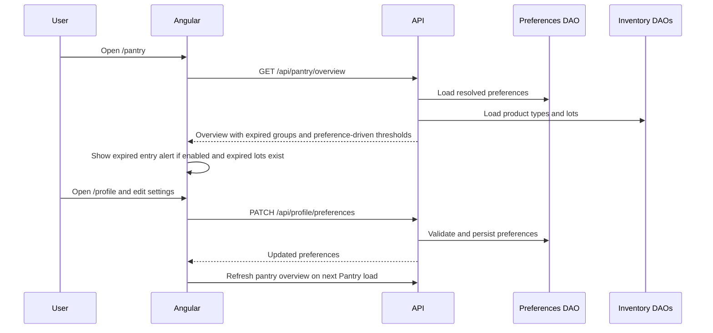

# Profile Preferences And Expired Alerts Design

## Status
- Direction approved in chat on 2026-04-28 Central Time.
- Design direction: `Hogar operativo`, mixing home-friendly clarity with
  operational control.
- Runtime code has not been changed by this design step.

## Goal
Add a real user configuration surface to PantryList and make expired inventory
impossible to miss when the user enters the app.

The feature introduces a protected `/profile` page where users can review basic
account information and configure pantry behavior. Pantry uses those preferences
to calculate expiration visibility, depletion warnings, and shopping-plan lead
time. Expired products receive a distinct `expired` state and trigger a calm,
visible entry alert whenever the user enters PantryList while the alert
preference is enabled.

## Non-Goals
- Do not build a full account-management replacement for Cognito.
- Do not edit Cognito email, password, MFA, or provider links inside PantryList.
- Do not add decorative settings that do not affect runtime behavior.
- Do not use blocking modals for expired products.
- Do not add AI suggestions in this slice.
- Do not create production deployment changes in this slice.

## Current State From The Repo
- Angular currently routes only `login` and `pantry` as active pages through
  `frontend/src/app/app-routing.module.ts`.
- The pantry page already displays expiration, durability/depletion, and
  shopping-plan information.
- Backend overview generation currently uses hardcoded expiration and shopping
  planning thresholds, including a 7-day expiration window and a 3-day shopping
  lead time.
- Expiration status currently distinguishes `critical`, `soon`, `stable`, and
  `none`, but expired products are not represented as a separate user-facing
  status.
- The local `users` collection now represents an app profile and ownership
  boundary. Cognito/social identities are linked through `authSubjectIds`.
- There is no persisted preferences model, profile settings API, or profile UI.

## Product Behavior
### Profile Page
Add `/profile` behind the existing auth guard.

The page has four sections:
- Account summary: username, email, account status, and connected identity count
  if available from the local profile.
- Expiration alerts: configure how many days count as "soon" and whether expired
  entry alerts are shown.
- Inventory planning: configure depletion warning sensitivity and shopping-plan
  lead days.
- Session actions: return to pantry and sign out.

The profile page should feel like a household control panel, not an enterprise
admin settings page. Default view should be easy to scan; advanced controls
should be grouped and explained with concise helper copy.

### Expired Entry Alert
When an authenticated user enters `/pantry`, the app evaluates the loaded pantry
overview. If at least one lot is expired and `showExpiredEntryAlert` is enabled,
the page shows a prominent non-modal alert near the top of the pantry workspace.

Rules:
- The alert appears on each app entry or full page reload while expired lots
  exist.
- Dismissing the alert hides it only for the current rendered Pantry visit. It
  is not persisted to localStorage, sessionStorage, or the backend; the alert
  appears again on the next full app entry if expired lots still exist.
- The alert includes the count of expired units/lots and a direct path to review
  those lots.
- The alert must not block normal inventory operations.
- If the user disables expired entry alerts in `/profile`, expired products
  still appear in the inventory list and priority panels, but the entry alert is
  suppressed.

### Expiration Status
Add a distinct `expired` expiration status.

Status semantics:
- `expired`: expiration date is before the current calendar date.
- `critical`: expiration date is the current calendar date.
- `soon`: expiration date is after today and within the configurable warning
  window.
- `stable`: expiration exists but is outside the warning window.
- `none`: no expiration date is set.

Expiration comparisons should use calendar-date semantics, not time-of-day
semantics, because the UI collects expiration as a date input.

Expired copy should say "Ya caducó" or "Caducado" instead of treating expired
items as merely urgent.

## Preferences Model
Preferences are user-scoped and persisted through the backend.

MVP fields:
- `expirationWarningDays`: number, default `7`, min `1`, max `60`.
- `showExpiredEntryAlert`: boolean, default `true`.
- `depletionWarningThresholdRatio`: number, default `1`, min `0.25`, max `4`.
- `shoppingPlanLeadDays`: number, default `3`, min `0`, max `30`.

Behavior:
- `expirationWarningDays` replaces hardcoded "soon" calculations.
- `showExpiredEntryAlert` controls only the entry alert, not expired status.
- `depletionWarningThresholdRatio` controls whether an item appears in
  "Se agotan pronto"; the default keeps current behavior by showing an item
  when estimated current quantity is less than or equal to one interval of
  consumption.
- `shoppingPlanLeadDays` replaces the hardcoded 3-day purchase planning lead.

Backend should centralize defaults so old users and missing fields always
resolve to a complete preference set.

## Architecture
### Backend
Add a preferences slice with database access behind a DAO/port so it can move
from MongoDB to another database later.

Recommended shape:
- `UserPreferences` domain/value object for validation and defaults.
- `UserPreferencesDao` application port.
- Mongo implementation backed by either an embedded `users.preferences` object
  or a separate `user_preferences` collection.
- `GetUserProfileUseCase` returns local profile plus resolved preferences.
- `UpdateUserPreferencesUseCase` validates and persists preference changes.
- Pantry overview use cases accept resolved preferences and pass them to
  expiration/depletion/shopping calculations.

Prefer a separate DAO boundary even if Mongo stores preferences embedded in
`users`; the application layer should not care where preferences live.

API endpoints:
- `GET /api/profile` returns account summary and resolved preferences.
- `PATCH /api/profile/preferences` updates preferences and returns the resolved
  preferences.

Both endpoints require the existing Cognito-backed auth guard and XSRF
protection for mutations.

### Frontend
Add a profile feature route and service methods:
- Route: `/profile`.
- API service: `getProfile()` and `updatePreferences()`.
- State: lightweight feature state or service-local state is acceptable for MVP;
  use NgRx only if the implementation needs shared profile state beyond the
  profile page and pantry shell.
- Pantry state should include preference-driven overview output from the
  backend instead of recalculating thresholds locally.

Navigation:
- Add a visible link from Pantry to Perfil/Configuración.
- Add a return link from Profile to Pantry.

### Data Flow

## UX And Visual Direction
Use the `.impeccable.md` `Hogar operativo` direction.

Profile layout:
- Warm, light, structured interface.
- One primary column for settings and one contextual summary column on wider
  screens.
- Group controls by household job: "Caducidad", "Durabilidad", "Compras".
- Avoid card nesting and avoid corporate dashboard density.
- Use calm alert language and strong hierarchy rather than alarm colors alone.

Expired alert:
- Should sit near the top of Pantry after the welcome/header area.
- Use direct language: "Hay productos que ya caducaron".
- Include one clear action: "Revisar caducados".
- Include dismissal for the current session.
- Do not use a modal, blocking overlay, or alarm-like tone.

## Accessibility And Responsiveness
- All preference controls need explicit labels and helper text.
- Numeric controls need min/max validation errors in UI and API.
- Expired alert must be announced politely with `aria-live="polite"` when it
  appears after loading.
- Color must not be the only way to distinguish expired, critical, soon, and
  stable states.
- Mobile layout keeps all settings available; no controls are hidden.
- Respect reduced-motion settings for any entry transitions.

## Error Handling
- Invalid preference payloads return `400` with field-specific or clear messages.
- Profile loading failure shows a retry state and does not break Pantry access.
- Preference update failure keeps the form values editable and reports the
  backend error.
- If preferences are missing or partially corrupt, backend resolves defaults
  rather than returning incomplete profile data.

## Testing Strategy
Backend:
- Unit tests for preference defaults and validation.
- Unit tests for expiration status with `expired` distinct from `critical`.
- Overview builder tests proving configurable warning days, depletion threshold,
  and shopping lead days affect output.
- Controller tests for `GET /profile` and `PATCH /profile/preferences`.

Frontend:
- Profile component tests for rendering loaded preferences and validation states.
- Service tests for profile API methods.
- Pantry component/store tests for expired alert visibility and dismissal.
- E2E smoke: login session, expired lot appears as expired, entry alert appears,
  profile preference disables the entry alert, Pantry no longer shows that entry
  alert after refresh.

Audits:
- `npm run build` and unit suites for backend/frontend.
- Browser smoke on `http://localhost:48673/profile` and `/pantry`.
- Secret scan before commit.
- Production dependency audit remains separate from dev-tooling audit.

## Design References For Implementation
Use these `impeccable` references during implementation:
- `reference/interaction-design.md` for settings forms and progressive
  disclosure.
- `reference/ux-writing.md` for alert copy and preference helper text.
- `reference/spatial-design.md` for profile layout rhythm.
- `reference/color-and-contrast.md` for calm expired/critical visual treatment.
- `reference/responsive-design.md` for keeping profile controls usable on mobile.

## Open Questions
- None blocking. The MVP should implement the four preference fields above and
  avoid expanding into notification channels, Cognito account management, or AI
  recommendations until a later feature.
