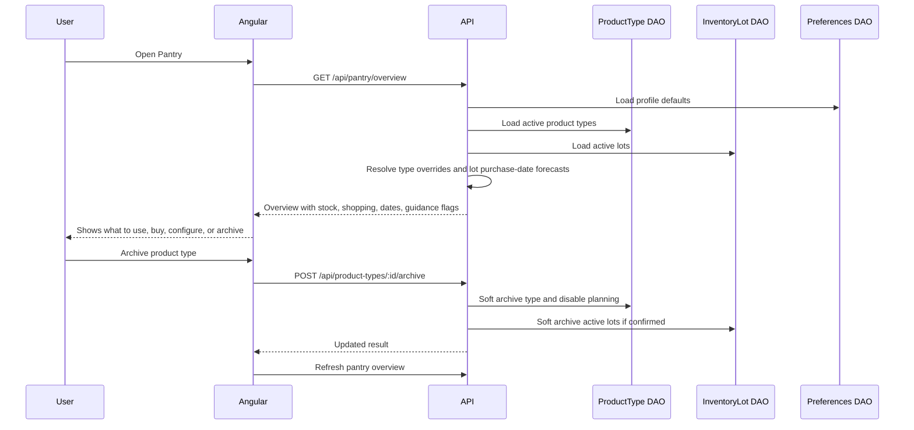

# Replenishment Intelligence And Guided UX Design

## Status
- Direction approved in chat on 2026-04-29 Central Time.
- Design direction: `Hogar operativo`, a warm household control surface with
  practical operational depth.
- Runtime code has not been changed by this design step.

## Goal
Make PantryList better at answering the household question: "What should we use
first, what is about to run out, and what should we buy next?"

This feature improves the durability and shopping model so products keep
appearing in purchase planning even after the last active lot is consumed. It
also adds clearer user-facing language, purchase-date visibility, per-type rule
overrides, guided onboarding help, and safe removal flows for things the user no
longer wants to track or buy.

## Non-Goals
- Do not add AI-generated meal planning, purchase prediction, or product
  recommendations in this slice.
- Do not add AWS scheduled jobs or background inventory mutation.
- Do not create a multi-household collaboration model.
- Do not restore local password auth or change Cognito account behavior.
- Do not build hard-delete-by-default flows that can silently remove important
  pantry history.
- Do not add barcode scanning or receipt import in this slice.

## Current State From The Repo
- `InventoryLot` already stores `purchaseDate`, but `PantryLotSummary` does not
  expose it to the grouped pantry UI.
- Durability forecasts are calculated from
  `ProductType.defaultDepletionRule.anchorDate`, not from the lot purchase date.
- Consuming a lot to zero deletes that lot. After the final lot is deleted,
  `buildPantryOverview` no longer creates a pantry group for that product type,
  so it disappears from the shopping plan.
- User preferences exist globally on the profile: expiration warning days,
  expired-entry alert toggle, depletion warning threshold, and shopping-plan
  lead days.
- Product types already have a default depletion rule, which is the right
  boundary for per-type planning overrides.
- Current shopping urgency has `depleted`, `critical`, and `upcoming`, but the
  copy and thresholds do not yet map clearly to household decisions.

## Product Behavior
### Replenishment Planning That Survives Zero Stock
Product types with active planning rules should remain visible in the shopping
plan even when every active lot has been consumed.

Rules:
- If a product type has an active depletion rule and no active stock, it appears
  as `Comprar ya`.
- If a product type has stock but the estimated current quantity is less than or
  equal to zero, it appears as `Comprar ya`.
- If the recommended purchase date is today or earlier, it appears as
  `Comprar esta semana`.
- If the estimated depletion date is within the next seven calendar days, it
  appears as `Comprar esta semana` even when the configured lead window is
  longer.
- If the product still has stock but the next purchase date is inside the
  configured lead window, it appears as `Comprar pronto`.
- Product types explicitly archived or disabled for planning do not appear in
  shopping recommendations.

The user should never need to keep a fake empty lot just so PantryList remembers
that detergent, shampoo, or coffee should be bought again.

### Durability Anchored To Real Purchases
Durability should account for when a product was bought or when its tracking
started.

Recommended MVP behavior:
- Keep the depletion rule on the product type.
- For each lot, use `purchaseDate` as the preferred consumption start date.
- If `purchaseDate` is missing, fall back to the product type rule `anchorDate`.
- Estimate consumed quantity per lot using the type rule and that lot's start
  date.
- Sum lot-level estimated remaining quantities into the product type's estimated
  current quantity.
- Manual consumption still subtracts from the recorded lot quantity. The
  estimate is derived from the remaining recorded quantity and elapsed time.

Example:
- A detergent type uses 1 liter every month.
- A 1-liter lot bought one month ago should estimate 0 liters remaining today.
- If that was the only tracked detergent, the shopping plan should say
  `Comprar ya`, not disappear.

This remains deterministic. No automatic database mutation is required just
because time passes.

### Criticality And Shopping Labels
Use labels that describe household action, not internal state.

Expiration labels:
- `Ya caducó`: expiration date is before today.
- `Caduca hoy`: expiration date is today.
- `Caduca pronto`: expiration date is inside the warning window.
- `Sin fecha`: no expiration was entered.

Shopping labels:
- `Comprar ya`: out of stock, estimated depleted, or no usable quantity remains.
- `Comprar esta semana`: due now or within the urgent window.
- `Comprar pronto`: should be bought before the next expected usage cycle.
- `Con margen`: visible only in detailed views, not in the urgent shopping panel.

The word `Crítico` can still exist as an internal severity, but user-facing copy
should prefer action language unless the section is explicitly a priority
summary.

### Purchase-Date Visibility
Every lot detail row should show purchase date when available.

Rules:
- Show `Comprado el <date>` below or next to expiration information.
- If the lot drives a durability forecast, show a concise explanation such as
  `Durabilidad calculada desde esta compra`.
- If purchase date is missing and durability is active, show
  `Sin fecha de compra; se usa la fecha de inicio del tipo`.

This makes it possible to understand why a product is being marked as depleted
or close to replenishment.

### Profile Defaults And Product-Type Overrides
Profile preferences should be defaults, not the only configuration layer.

Add per-product-type planning settings:
- `expirationWarningDaysOverride`: optional number. If missing, use profile
  `expirationWarningDays`.
- `depletionWarningThresholdRatioOverride`: optional number. If missing, use
  profile `depletionWarningThresholdRatio`.
- `shoppingPlanLeadDaysOverride`: optional number. If missing, use profile
  `shoppingPlanLeadDays`.
- `planningEnabled`: boolean, default `true` for product types with an active
  depletion rule.

Do not add per-lot overrides in the MVP unless required by a specific household
case. Product-type overrides solve the examples already described: detergent,
shampoo, tuna, apples, ham, and other base types can behave differently without
turning each lot into a settings form.

UI behavior:
- Profile explains that these are household defaults.
- Product type detail/editor shows `Usa defaults del perfil` by default.
- Users can expand `Ajustes de este tipo` to override only the fields they need.
- Each override should show what default value it is replacing.

### Safe Removal And Archive Flows
Users need to remove things they no longer want to track or buy.

Use "archive/stop tracking" as the default destructive-adjacent action:
- Archive a lot: hide it from active inventory and calculations.
- Archive a product type: hide it from active inventory, search suggestions,
  durability alerts, and shopping plan.
- Disable planning for a product type: keep visible inventory but remove it from
  shopping recommendations.

Hard delete should be secondary and guarded:
- MVP hard delete is allowed only from an archived state and only after a
  confirmation that names the affected item. Active pantry actions should
  default to archive or pause planning.
- Prefer soft archive fields in persistence, such as `archivedAt` and
  `archivedReason`, so future audit/history screens remain possible.
- If a product type has active lots, the default action should explain the
  consequence and offer `Archivar tipo y sus lotes` rather than silently
  deleting children.

Suggested actions:
- Lot row: `Consumir`, `Editar`, `Archivar lote`.
- Product type detail: `Editar reglas`, `Pausar compras`, `Archivar tipo`.
- Shopping plan item: `Marcar como no comprar más`, which disables planning or
  archives the type depending on whether active stock remains.
- Profile/settings area: `Elementos archivados`, where archived types and lots
  can be restored or permanently deleted.

### Guided Help And Tutorial
Add contextual guidance that teaches the model without blocking use.

Guidance states:
- `Mostrar ayuda`: default for new users.
- `Ocultar por ahora`: hides guidance for the current visit.
- `No volver a mostrar`: persists the preference in the profile.
- `Restaurar ayudas`: profile action that re-enables guided tips.

MVP guidance:
- First registration helper: explains type base, variant/brand, quantity,
  expiration date, purchase date, and durability.
- Durability helper: explains that PantryList estimates usage over time and
  that manual consumption corrects real-life events such as gifts, spills, or
  unusual usage.
- Shopping helper: explains `Comprar ya`, `Comprar esta semana`, and
  `Comprar pronto`.
- Archive helper: explains the difference between consuming something and
  removing it from future planning.

Guidance should be inline and collapsible, not a blocking modal. It should feel
like a calm household checklist, not a software tour overlay.

### Copy Direction
Use direct household language.

Replace or avoid:
- `Reposición` as a main label when `Compras sugeridas` is clearer.
- `Se agotan pronto` when `Por acabarse` is clearer.
- `Estimado actual` without explanation when users need to know why it changed.
- `Unidad canónica` in user-facing forms; use `Unidad principal`.
- `Contar desde`; use `Empezar cálculo desde`.

Preferred sections:
- `Qué revisar primero`
- `Por acabarse`
- `Compras sugeridas`
- `Despensa por tipo`
- `Reglas de este tipo`
- `Ayuda para usar PantryList`

## Architecture
### Backend
Add a planning-aware read model while keeping DAO boundaries clear.

Recommended changes:
- Extend `PantryLotSummary` with `purchaseDate`.
- Add product-type planning fields to the domain entity and Mongo schema:
  optional overrides and `planningEnabled`.
- Keep `UserPreferences` as global defaults.
- Resolve effective preferences per product type in `buildPantryOverview`.
- Update depletion forecast logic to support lot-level purchase-date starts.
- Build pantry overview from product types first, then attach active lots. This
  lets zero-stock product types with active planning rules appear in shopping
  plan output.
- Add archive support to product types and inventory lots with soft-delete
  fields.

Suggested read-model additions:
- `effectivePreferences` on `PantryOverviewItem` or a compact planning metadata
  object.
- `purchaseDate` on each lot summary.
- `stockStatus`: `in_stock`, `low_stock`, `estimated_depleted`,
  `out_of_stock`, or similar.
- `trackingStatus`: active, planning_paused, archived.

API additions:
- `PATCH /api/product-types/:id/planning-settings`
- `POST /api/product-types/:id/archive`
- `POST /api/product-types/:id/restore`
- `DELETE /api/product-types/:id`
- `POST /api/inventory-lots/:id/archive`
- `POST /api/inventory-lots/:id/restore`
- `DELETE /api/inventory-lots/:id`

All mutations must require existing Cognito auth and XSRF protection.

### Frontend
Keep the pantry screen as the main operational workspace, but reduce ambiguity.

Recommended changes:
- Rename panels to action-oriented copy.
- Show purchase date in lot rows.
- Add per-type settings inside the expanded product type panel.
- Add archive/pause actions with confirmation copy.
- Add inline guidance cards controlled by profile preference.
- Update shopping urgency labels and visual hierarchy.

NgRx can keep pantry overview as the source of truth. Profile preferences remain
loaded through profile API, while pantry overview should return effective
per-type settings to avoid duplicating calculation logic in Angular.

## Data Flow

## UX And Visual Direction
Follow `Hogar operativo`.

The page should feel practical and calm:
- Important actions are visible without panic.
- Detail settings are progressive.
- Inventory math is explained in plain language.
- Archive/delete actions are serious but not scary.
- Tutorial help sits near the relevant task instead of interrupting the user.

Avoid:
- Dense admin tables for every item.
- Destructive red buttons as the default action.
- Modal-heavy onboarding.
- Abstract labels that require technical knowledge.

## Accessibility And Responsiveness
- Archive and delete actions need accessible names that include the item name.
- Confirmation copy must explain exactly what will stop appearing in planning.
- Guidance cards need normal text, not only icons.
- Color cannot be the only difference between `Comprar ya`,
  `Comprar esta semana`, and `Comprar pronto`.
- Mobile layouts must keep purchase date, status, and main action visible
  without horizontal scrolling.

## Error Handling
- If archiving fails, keep the row visible and show a retryable error.
- If a product type has active lots, archive confirmation must mention them.
- If a planning override is invalid, preserve entered values and show the
  accepted range.
- If purchase date is missing, forecasts must fall back safely and explain the
  fallback in the UI.
- If all lots are gone but planning remains active, show zero stock as a valid
  state, not an empty-state bug.

## Testing Strategy
Backend:
- Forecast test: a 1-liter monthly item bought one month ago estimates 0
  remaining.
- Shopping plan test: product type with active planning and zero lots appears as
  `Comprar ya`.
- Override test: product type shopping lead days override profile defaults.
- Archive test: archived product type is excluded from overview and search.
- Purchase date mapping test: pantry lot summary includes `purchaseDate`.

Frontend:
- Pantry component renders purchase date in lot rows.
- Shopping labels render as `Comprar ya`, `Comprar esta semana`, and
  `Comprar pronto`.
- Per-type settings show inherited defaults and override values.
- Archive action shows confirmation and refreshes pantry overview.
- Guidance can be hidden for now and disabled from the profile.

E2E:
- Create monthly detergent with purchase date one month ago and verify it lands
  in `Comprar ya`.
- Consume the final lot and verify the product remains in shopping plan.
- Disable future buying for a type and verify it leaves shopping plan.
- Hide tutorial guidance and verify it stays hidden according to the selected
  preference.

## Risks And Decisions
- The biggest domain risk is confusing recorded stock with estimated stock. The
  UI must explain both: recorded stock is what the user entered after manual
  consumption; estimated stock is PantryList's time-based forecast.
- Soft archive adds data-model complexity, but it is safer than hard delete and
  preserves future audit options.
- Per-lot overrides are intentionally deferred. Product-type overrides should
  cover the current use cases with less form complexity.
- Building overview from product types first is a bigger backend change than
  patching the current lot-first loop, but it is the correct foundation for
  zero-stock shopping recommendations.

## Resolved Scope Decisions
- Archived product types and lots should be restorable from an
  `Elementos archivados` area in the first implementation.
- `Comprar esta semana` uses a fixed seven-calendar-day urgent window because
  the phrase is user-facing and should not change meaning when shopping lead
  preferences change.
- Hard delete exists in the MVP only after archive, with explicit confirmation.
  Normal pantry flows use archive or pause planning first.
